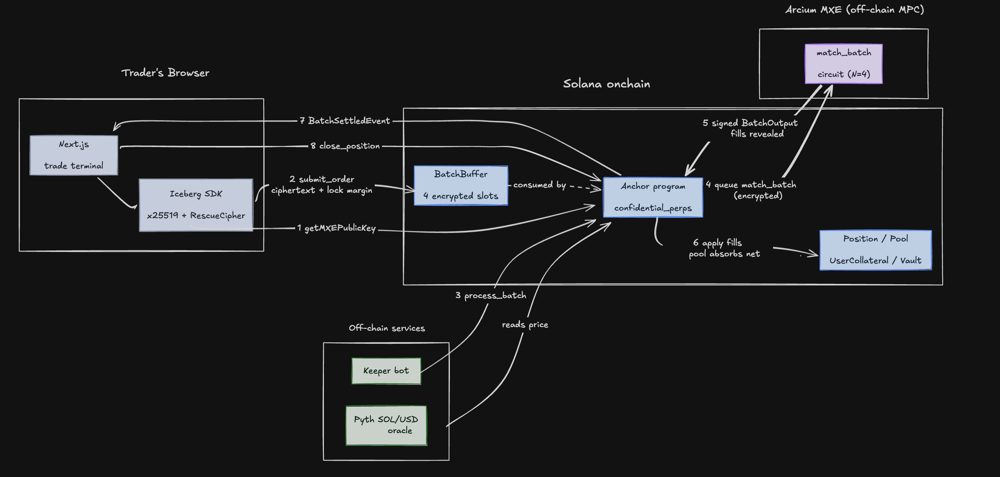

# Iceberg

**The first confidential perpetual futures DEX on Solana.** Orders are encrypted in your
browser, matched inside Arcium's MPC network, and settled on-chain via Anchor — your side,
size, and price stay invisible to everyone .

> _Trade with size on Solana. Without showing your hand._

Like an iceberg order, your size stays below the surface — only here, nothing shows pre-match
at all. Built for the Solana India Fellowship (SIF).

**Status:** devnet program `EhTFnsoyZp9aRYoZrFPVPtokiRLwjxvAgZAuEQG8yZgF` · one market (SOL-PERP)
· USDC collateral · full lifecycle proven end-to-end on a local Arcium cluster. Not audited.

---

## The problem

Solana's transparency is a feature for verification and a tax on trading. Every order on a
public DEX is visible the moment it lands: strategies get copied, sandwich bots front-run flow
(hundreds of millions extracted), and the funds that trade real size stay on centralized
exchanges because their alpha leaks the instant they touch a transparent order book.

Solana captured retail trading. To capture institutional flow, it needs **pre-trade privacy** —
the dark-pool primitive Solana DeFi has been missing. Arcium's MPC network (encrypted compute on
Solana) makes it possible for the first time.

## What Iceberg does

Iceberg hides the part of a trade that leaks alpha and invites MEV: **the order itself.**

- You build an order in the browser. The SDK encrypts `{side, price, size}` client-side with
  **x25519 ECDH + RescueCipher** against the MXE's public key.
- Only the ciphertext goes on-chain, into a shared batch buffer. No validator, no bot, and **no
  single MPC node** can read it.
- A sealed-bid **batch auction runs inside an Arcium MPC circuit**. It sees the orders only in
  secret-shared form, matches them, and reveals **only the resulting fills** — like a dark pool
  printing to the tape.
- Fills settle on-chain into per-trader positions.

**Privacy model (be precise):** confidentiality is **pre-trade**. Order side/price/size are
hidden until matched. Resulting **positions are public on-chain in v0** — encrypting the
position itself is the next milestone (v0.2).

---

## Architecture



**End-to-end flow:**

1. The browser fetches the MXE public key (`getMXEPublicKey`) to encrypt against.
2. The SDK encrypts the order and `submit_order` writes the `EncryptedOrderSlot` into the
   per-market `BatchBuffer`, locking `max_margin` USDC from the trader's `UserCollateral`.
3. The permissionless **keeper** polls the buffer; once the batch window (~20s) closes and there
   is ≥1 order, it calls `process_batch`.
4. `process_batch` reads the Pyth oracle, then queues the `match_batch_oc` computation to Arcium with
   the encrypted order envelopes + the public oracle price as inputs.
5. The Arcium MPC cluster runs the circuit over secret-shared inputs and returns a **signed**
   `BatchOutput` — the matching is the only place plaintext order data is ever reconstructed, and
   even there it's split across nodes.
6. `match_batch_oc_callback` verifies the signature and applies the revealed fills to each
   `Position`; the `Pool` absorbs the net imbalance at the clearing price; the buffer resets and a
   `BatchSettledEvent` is emitted.
7. The app subscribes to program logs, sees the event, and refreshes positions + collateral.
8. The trader closes via `close_position` (PnL realized against the oracle), or the keeper
   liquidates if margin falls below maintenance.

## The matching engine (v0a)

A pure peer-to-peer batch auction only fills when an opposing order happens to coincide in the
same window — on a thin venue, most orders strand. Iceberg uses an **oracle-pegged,
pool-backstopped batch auction** instead:

- **Clearing price = the Pyth oracle.** An order fills its **full size** iff it crosses:
  long fills when `price ≥ oracle`, short when `price ≤ oracle`. No crossing → fills 0, margin
  refunded. Nothing ever bricks.
- **Peers match first.** Opposing orders net against each other. A singleton **`Pool` PDA**
  absorbs only the residual imbalance at the oracle price — untouched when the batch is balanced
  (pure peer-to-peer). A lone order simply fills against the pool.
- Because every crossing order fills fully, **nobody is rationed** ⇒ no pro-rata ⇒ **no MPC
  division and no carry-over**, which keeps the circuit cheap (N=4, **1.107B ACU**).

Reference models: Flash Trade "pool-to-peer", Jupiter JLP, Drift AMM-backstop.

---

## Tech stack

| Layer                | Choice                                                     |
| -------------------- | ---------------------------------------------------------- |
| Chain                | Solana                                                     |
| Program              | Anchor (`@anchor-lang/core` 1.0.2, the Arcium-pinned fork) |
| Confidential compute | Arcium MXE + Arcis circuits                                |
| Oracle               | Pyth Pull (SOL/USD)                                        |
| Client crypto        | x25519 ECDH + RescueCipher (`@arcium-hq/client`)           |
| Frontend             | Next.js 16 · React 19 · Tailwind v4 · TanStack Query       |
| Wallet               | `@solana/wallet-adapter`                                   |
| Keeper               | TypeScript poll-loop bot                                   |
| Package manager      | pnpm (workspace)                                           |

## Repo layout

| Path                           | Purpose                                                              |
| ------------------------------ | -------------------------------------------------------------------- |
| `programs/confidential_perps/` | Anchor program — state, instructions, callbacks, Pyth reader         |
| `encrypted-ixs/`               | Arcis confidential circuits (`match_batch_oc`, `add_together` canary)|
| `sdk/`                         | TypeScript SDK — PDA derivation, order encryption, fill decryption   |
| `app/`                         | Next.js app — marketing landing (`/`) + `/trade` terminal            |
| `keeper/`                      | Batch cranker + permissionless liquidator + (localnet) oracle pusher |
| `scripts/`                     | Localnet bootstrap, lifecycle driver, state inspector, e2e scenarios |
| `tests/`                       | Anchor + TS integration tests (13/13 green)                          |

---

## Run it locally

Build and test the program + circuit:

```bash
arcium build          # anchor + arcis circuit + idl + ts types
arcium test           # first run: does MXE keygen, persists keys
pnpm test             # subsequent runs: arcium test --skip-keygen (fast)
```

Run the full app against a local Arcium cluster (4 terminals). Requires the **Docker daemon**
(Arcium's MPC nodes run in containers):

```bash
# 1 — local validator + Arcium MPC cluster
arcium localnet --skip-keygen

# 2 — once: create USDC mint, init market + pool, register the circuit,
#     seed the live oracle, and write app/.env.local
pnpm exec tsx scripts/localnet-bootstrap.ts

# 3 — keeper: auto-cranks batches, liquidates, pushes live SOL/USD
pnpm --filter @confidential-perps/keeper start

# 4 — the app; open http://localhost:3000/trade
pnpm --filter @confidential-perps/app dev
```

In `/trade`: connect a burner wallet → "Get USDC" (faucet) → deposit → submit an encrypted
order → the keeper cranks → watch it fill against the pool (or a peer) → close for PnL.

---

## Program interface

**Instructions**

| Instruction                                                                                   | What it does                                                          |
| --------------------------------------------------------------------------------------------- | --------------------------------------------------------------------- |
| `init_market(pyth_feed_id)`                                                                   | One-time, immutable market init (SOL-PERP).                           |
| `init_pool(amount)`                                                                           | Fund the singleton LP backstop.                                       |
| `init_match_batch_comp_def`                                                                   | Register the `match_batch_oc` Arcium computation definition.          |
| `deposit(amount)` / `withdraw(amount)`                                                        | Move USDC between wallet and vault (5%/slot withdraw cap).            |
| `submit_order(x25519_pubkey, nonce, max_margin, ct_side, ct_price, ct_size, ct_client_nonce)` | Place an **encrypted** order; locks margin.                           |
| `cancel_order()`                                                                              | Owner reclaims a pending order + margin.                              |
| `process_batch(computation_offset)`                                                           | Permissionless crank: reads Pyth, queues the MPC match.               |
| `expire_batch()`                                                                              | Permissionless recovery: reset a `BatchBuffer` wedged by a dropped computation (after a timeout). |
| `match_batch_oc_callback`                                                                     | Arcium callback: applies fills, pool absorbs net, resets buffer.      |
| `close_position()`                                                                            | Realize PnL against the oracle, release margin.                       |
| `liquidate_position()`                                                                        | Permissionless close at 50% maintenance.                              |
| `set_mock_oracle(price)`                                                                      | **Localnet/demo only** (`mock-oracle` feature) — pushes a live price. |

**Accounts (PDAs)**

| Account          | Seeds                          | Holds                                                           |
| ---------------- | ------------------------------ | --------------------------------------------------------------- |
| `Market`         | `["market"]`                   | feed id, USDC mint/vault, batch window, rate-limit state        |
| `BatchBuffer`    | `["batch", market]`            | 4 encrypted order slots, `n_orders`, `is_processing`            |
| `UserCollateral` | `["collateral", market, user]` | deposited USDC balance                                          |
| `Position`       | `["position", market, owner]`  | `base_amount_lots` (i64), `quote_entry` (i128), `margin_locked` |
| `Pool`           | `["pool", market]`             | LP backstop position + collateral                               |
| _USDC vault_     | ATA, authority = `Market` PDA  | pooled collateral                                               |

---

## Security & defensive design

Built with the Drift $285M-hack lessons in mind — the attack surface is minimized by omission:

- **No `update_oracle_source`** — the Pyth feed id is pinned at market init and validated against
  every price update.
- **No `add_collateral_type`** — USDC is hardcoded.
- **No `update_admin`** — no privileged admin field; the program is immutable post-deploy.
- **Withdrawal rate limit** — per-slot USDC out is capped at 5% of the vault snapshot.
- **Oracle guards** — reject stale prices (>30s) and wide confidence intervals (>1%).

## Honest scope

What's real today, and what's explicitly deferred:

- ✅ Client-side encrypted orders, MPC batch matching, on-chain settlement, deposit/withdraw,
  close, permissionless liquidation, live oracle, keeper automation — all proven end-to-end.
- ⚠️ **Positions are on-chain** (v0). Encrypted position commitments are v0.2 — the SDK
  already uses Arcium threshold encryption so this can be added without a protocol rewrite.
- ⚠️ **`mock-oracle` and `test-stale-ok` are demo/localnet features** in the default build and
  **must be stripped before any devnet/mainnet deploy** (they relax the oracle trust boundary).
- ⚠️ Market orders only (no resting limit orders yet). Devnet only.

## Roadmap

1. **Encrypted positions (v0.2)** — close the thesis gap; positions become confidential too.
2. **Pool hardening** — enforce the skew cap + a continuous solvency invariant; security review.
3. **Product depth** — funding rate, resting limit orders (v0b).

## References

- Arcium — <https://docs.arcium.com/developers>
- Pyth Pull oracle — <https://docs.pyth.network/price-feeds/use-real-time-data/solana>
- Drift v2 (perp accounting reference) — <https://github.com/drift-labs/protocol-v2>
